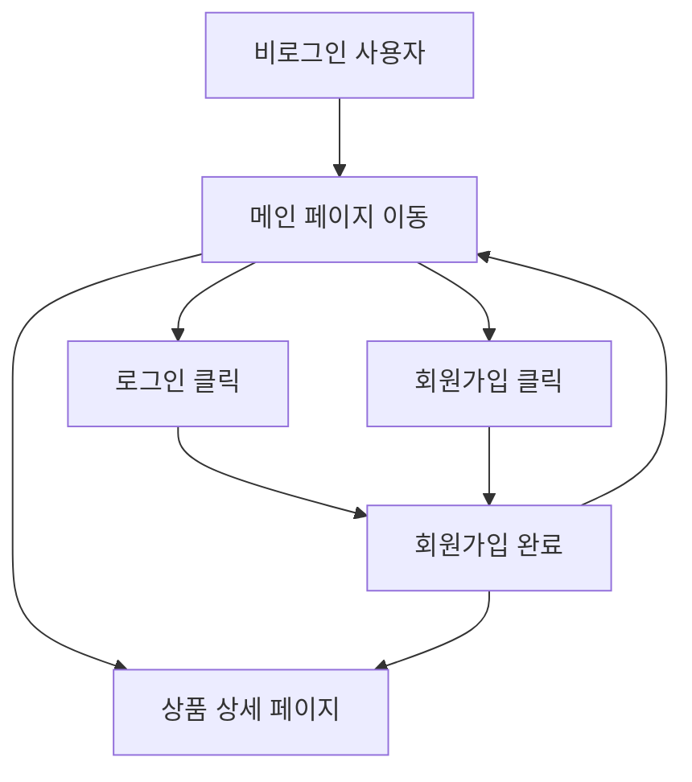
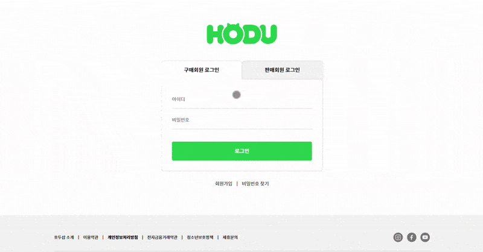
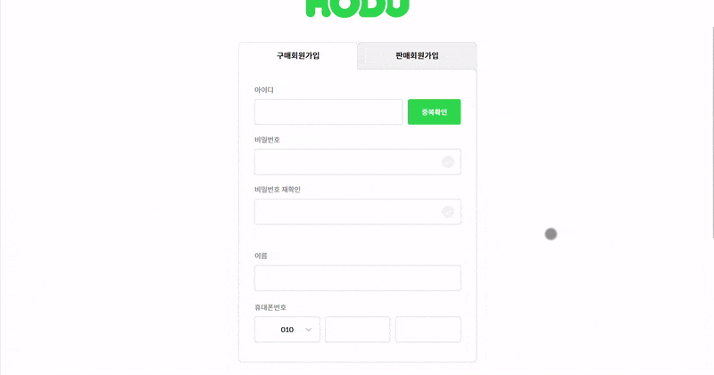
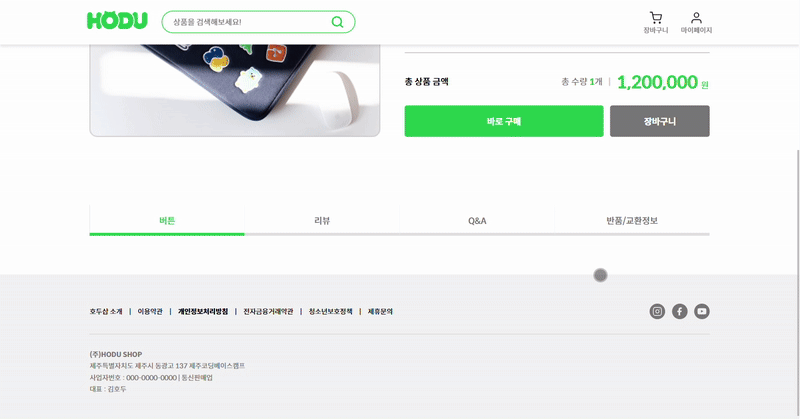
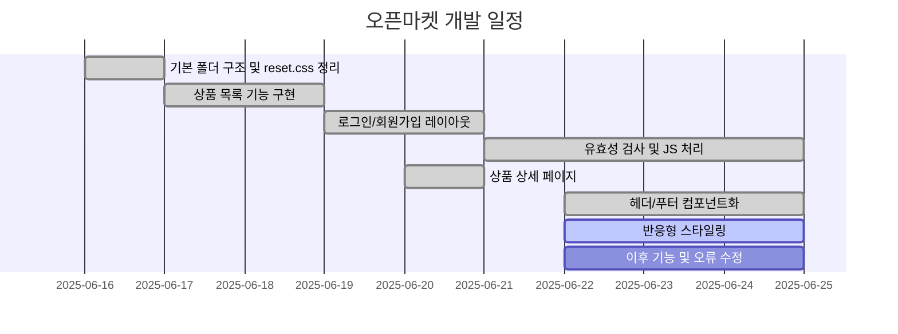

# 오픈 마켓 서비스

## ✨ 프로젝트 소개

간단한 오픈마켓 형태의 웹 애플리케이션입니다.

---

## 1. 목표와 기능

### 1.1 목표

- 상품을 구매하고 판매할 수 있는 간단한 마켓 서비스 제작
- 바닐라 JavaScript, 반응형 웹, 유효성 검사 및 API 연동 경험 강화

### 1.2 팀 구성

- 개인 프로젝트

### 1.3 구현된 기능

- 로그인 / 회원가입 (유효성 검사 포함)
- 상품 목록 (홈 화면)
- 상품 상세 페이지
- 반응형 웹 적용

---

## 2. 개발 환경 및 배포 URL

### 2.1 개발 환경

- 개발 도구: Visual Studio Code
- 언어: JavaScript (ES6+)
- 실행 환경: Edge, Chrome
- 패키지 매니저: 사용하지 않음 (Vanilla JS 기반)
- 기타 도구: Live Server (로컬 개발용)

### 2.2 배포 URL

- [https://chohc.github.io/Modu_MiniProject2_OpenMarket/](https://chohc.github.io/Modu_MiniProject2_OpenMarket/)

### 2.3 URL 구조

| URL                   | 페이지 설명     | HTML 파일명          |
| --------------------- | --------------- | -------------------- |
| `/index.html`         | 상품 목록 (홈)  | `index.html`         |
| `/productDetail.html` | 상품 상세       | `productDetail.html` |
| `/login.html`         | 로그인          | `login.html`         |
| `/signup.html`        | 회원가입        | `signup.html`        |
| `/404.html`           | 404 에러 페이지 | `404.html`           |

---

## 3. 기능 흐름도

- 로그인하지 않아도 상품 목록과 상세 페이지 접근 가능
- 헤더에서 로그인/회원가입 가능
- 로그인/회원가입 완료 시 메인 페이지로 리다이렉트
- 로그인 여부와 관계없이 상품 상세 페이지 접근 가능



## 4. 프로젝트 구조

```
📦 Modu_MiniProject2
├── 📂assets
│   └── 📂images
├── 📂css
│   ├── 📂components
│   │   ├── amount.css
│   │   ├── card.css
│   │   ├── footer.css
│   │   └── header.css
│   ├── 📂pages
│   │   ├── common-login-signup.css
│   │   ├── login.css
│   │   ├── productDetail.css
│   │   ├── products.css
│   │   └── signup.css
│   ├── common.css
│   ├── reset.css
│   └── variables.css
├── 📂js
│   ├── 📂components
│   │   ├── Amount.js
│   │   ├── Card.js
│   │   ├── Footer.js
│   │   └── Header.js
│   ├── 📂pages
│   │   ├── login.js
│   │   ├── productDetail.js
│   │   ├── products.js
│   │   └── 📂signup
│   │       ├── inputHandler.js
│   │       ├── signup.js
│   │       └── validator.js
│   ├── 📂utils
│   │   ├── modalUtils.js
│   │   └── tabUtils.js
│   ├── common.js
│   └── config.js
├── .gitignore
├── 404.html
├── index.html
├── login.html
├── productDetail.html
├── signup.html
└── README.md
```

## 5. 구현 화면

로그인


회원가입


상품 목록


상품 상세


## 6. 주요 기능 및 코드 설명

🟩 로그인 / 회원가입 유효성 검사
signup/validator.js: input들 유효성 검사 수행

signup/inputHandler.js: 입력 필드 상태 관리 및 에러 메시지 표시

signup/signup.js: 이벤트와 핸들러 초기화 및 회원가입 submit 처리

login.js: 로그인 요청 및 실패 시 에러 처리

🟦 상품 목록
products.js: API로부터 상품 목록을 받아와서 Card.js로 렌더링

Card.js: 상품 카드를 HTML로 생성하는 컴포넌트

🟨 상품 상세
productDetail.js: URL 파라미터로 상품 ID를 가져와 상세 정보 렌더링

Amount.js: 수량 버튼과 총합 계산 기능

🟫 공통 컴포넌트
Header.js, Footer.js: 모든 페이지에 공통적으로 사용되는 UI 요소 구성

common.js: 페이지 공통 초기화 로직

modalUtils.js, tabUtils.js: 모달과 탭 관련 유틸 함수

## 7. 개발 일정



## ✅ To-do (추후 개선 예정)

코드 리팩토링 및 모듈 정리

헤더 개선

SPA 변환
